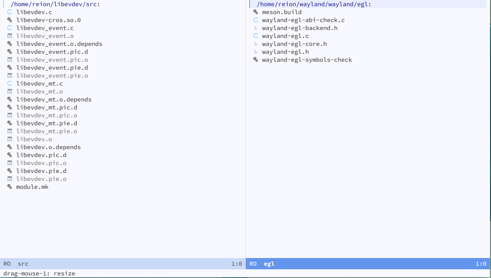

# Dired mimetype icon mode

This extension allows to display file and folder icons in dired mode and uses mimetype as the displayed logo and adheres to the icon-theme-spec file naming convention, which will help you to apply icon themes that you can download from the internet in your emacs.

Many thanks to @vinceliuice, whose icon resource files for the mimes section of the WhiteSur-icon-theme work are used in this repository by default.



## Installation

* Clone the repository to your emacs extension directory

* Add the following code to your `~/.emacs`

```elisp
(require 'dired-mimeicon)

(add-hook 'dired-mode-hook 'dired-mimeicon-mode)
```

## Option

* `dired-mimeicon-name`: Usually under the themes folder there are subfolders that store a list of themes, and this variable is the name of the icon theme.

* `dired-mimeicon-dir`: The location of the directory to look for, the default is the current `themes` folder.

## Contributor

<a href = "https://github.com/reionwong/dired-mimeicon/graphs/contributors">
  
</a>
